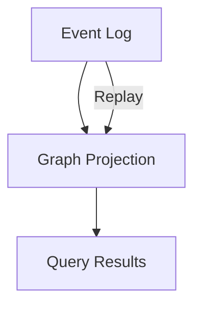
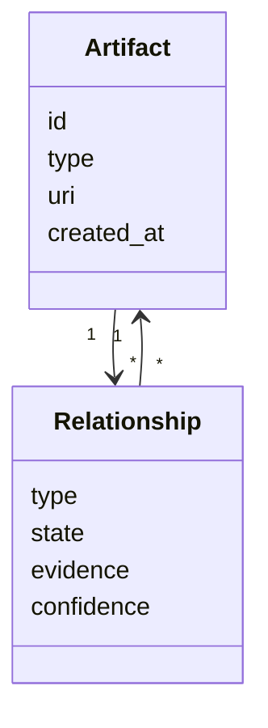
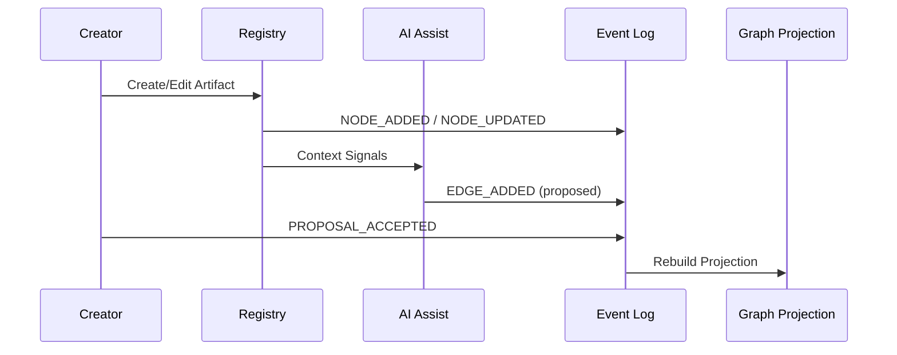
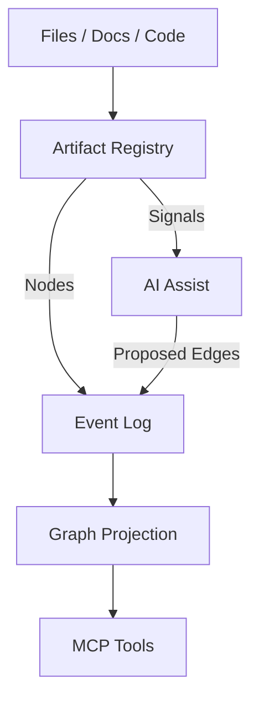
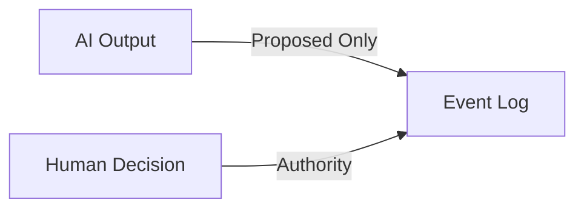
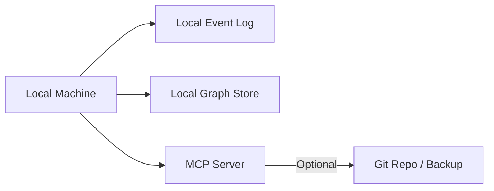

# Architecture Specification — AI-Native Traceability System

## 1. Purpose

This document defines the **system and data architecture** for the AI-Native Traceability System. It translates the Design Specification and CONOPS into concrete architectural views, using **Mermaid diagrams** for clarity and portability.

The architecture is intentionally minimal, local-first, and AI-first, with a strong separation between **authoring**, **semantics**, and **authority**.

---

## 2. Architectural Overview

### 2.1 Architectural Style

- Event-sourced
- Graph-centric
- Local-first
- Tool-agnostic
- AI-assisted, human-authoritative

Core architectural axiom:
> **Artifacts are inputs. Relationships are the system.**

---

## 3. System Architecture (Component View)

```mermaid
graph LR
    A[Creator Tools
(IDE, Editor, Notebook, Docs)] --> B[Artifact Registry]

    B --> E[Event Log
Append-Only]

    E --> C[Graph Projection Store]

    C --> D[MCP Interface]

    F[AI Assistance Service] -->|Proposals| E
    B -->|Context Signals| F

    D --> G[Human / AI Consumers]

    H[Optional UI
(Graph / Timeline)] --> D
```

**Key points:**
- The **Event Log** is the source of truth
- The **Graph Projection** is rebuildable
- The **AI Service never writes authoritative state directly**

---

## 4. Data Architecture

### 4.1 Core Data Stores



- **Event Log**: immutable record of all changes
- **Graph Projection**: materialized, queryable state
- **Queries** never mutate state

---

### 4.2 Logical Data Model



- Relationships are **typed and stateful** (`proposed` vs `authoritative`)
- Evidence is mandatory for AI proposals

---

## 5. Event Architecture

### 5.1 Event Flow



---

## 6. System Flow (Operational View)


This flow ensures:
- Traceability emerges from work
- No separate documentation phase

---

## 7. Data Flow Diagram



---

## 8. Trust & Authority Boundaries



- AI cannot bypass human acceptance
- Authority is explicit and auditable

---

## 9. Deployment Architecture



- Fully functional offline
- Sync/export is optional, not required

---

## 10. Architectural Constraints & Guardrails

- No silent inference
- No mandatory cloud dependency
- No monolithic schema
- No visualization-first design

---

## 11. Architectural Risks

| Risk | Mitigation |
|---|---|
| Proposal overload | Conservative defaults, batching |
| Schema creep | Minimal core + extension points |
| Trust erosion | Evidence-first proposals |

---

## 12. Summary

This architecture supports:
- Semantic traceability
- Temporal memory
- AI-assisted structure without loss of human control

It deliberately avoids legacy documentation systems and visualization-driven tooling in favor of **meaningful, queryable relationships that persist over time**.

---

*This Architecture Specification completes the core design artifacts. Implementation can proceed incrementally against this structure.*

