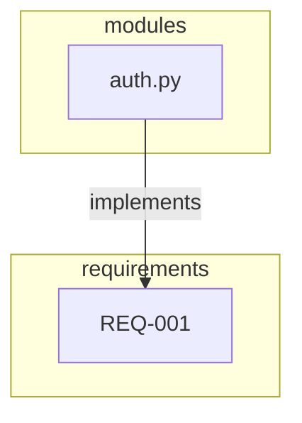

# Reports & Queries

Human-facing outputs you explicitly request. These are the "so what" of traceability.

## Visualization

### Dependency Map (Mermaid)

```
"Generate a mermaid diagram of the auth module dependencies"
"Show me the full dependency graph"
"Dependency map for requirements only"
```

**Output:** Mermaid flowchart you can paste into markdown or render at mermaid.live



**Options:**
- `root` - Start from specific artifact
- `depth` - Limit traversal depth
- `direction` - upstream, downstream, or both
- `artifact_types` - Filter to specific types
- `format` - mermaid, dot (Graphviz), or json

### Graphviz (DOT)

```
"Export dependency map as DOT format"
```

**Output:** DOT syntax for Graphviz rendering

```bash
# Render locally
echo "[dot output]" | dot -Tpng -o graph.png
```

## Traceability Reports

### Requirements Traceability Matrix (RTM)

```
"Generate an RTM"
"Show me the requirements traceability matrix as CSV"
```

**Output:** Table showing requirements → implementations → tests

| Requirement | Implementations | Tests | Status |
|-------------|-----------------|-------|--------|
| REQ-001 | auth.py | test_auth.py | ✅ Fully Traced |
| REQ-002 | - | - | ❌ Orphan |

**Formats:** md (default), csv, json

**Use cases:**
- Stakeholder reviews
- Compliance audits
- Sprint planning (what's not implemented?)

### Coverage Report

```
"Show me coverage gaps"
"What requirements are orphaned?"
"Which modules have no tests?"
```

**Output:** Gap analysis

```markdown
## Summary
- Requirements: 2/10 orphaned
- Modules: 5/20 untested
- Decisions: 1/3 undocumented
- Pending approvals: 7

## Orphan Requirements (no implementation)
- REQ-007
- REQ-009
```

**Formats:** md (default), json

## Change Management

### Impact Report

```
"What's affected if I change auth.py?"
"Impact report for the database module"
"Show me blast radius for REQ-001"
```

**Output:** Change impact analysis

```markdown
# Impact Report

**Risk Level:** 🔴 High
**Total Affected:** 12 artifacts

## auth.py
- Direct dependents: 3
- Transitive dependents: 12

## Affected by Type
### tests (5)
- test_auth.py
- test_login.py
...
```

**Use cases:**
- Pre-change analysis
- Release planning
- Stakeholder communication

### Decision Log

```
"Show me all decisions"
"What decisions did we make this month?"
"Export decision log as JSON"
```

**Output:** Chronological decision history

```markdown
# Decision Log

## DD-001-use-networkx
**File:** docs/decisions/dd_001.md
**Status:** authoritative
**Tags:** architecture, storage
```

## Quick Reference

| What You Want | Ask For |
|---------------|---------|
| See dependencies | "Dependency map for X" |
| Check requirements coverage | "Generate RTM" |
| Find gaps | "Coverage report" |
| Pre-change analysis | "Impact report for X" |
| Project history | "Decision log" |
| Find artifacts | "Search for auth" |
| Check health | "Run health check" |
